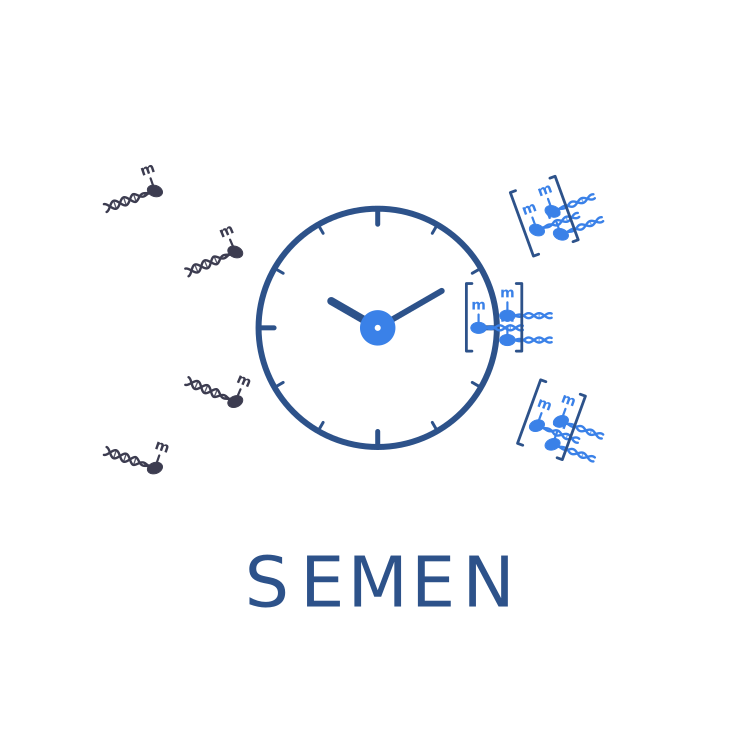
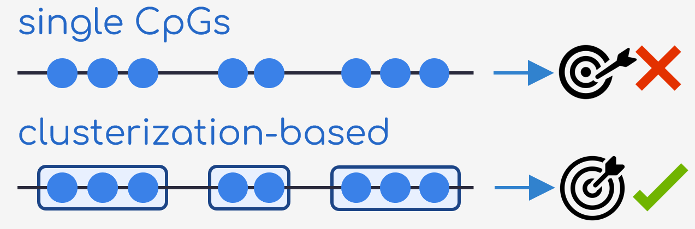
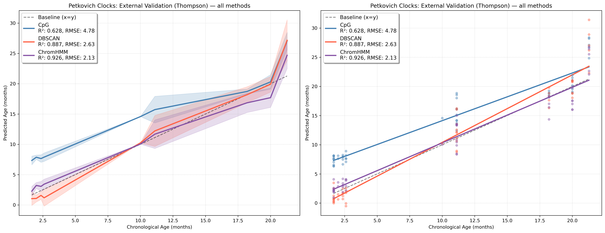
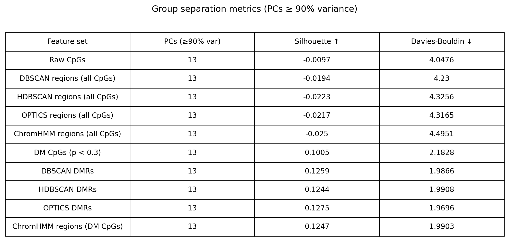

<p align="right">



</p>

# SEMEN — SEgmentation for MEthylation Noise reduction

> Grouping nearby CpG sites into segments to build better aging clocks and to improve separation of disease and healthy samples from DNA methylation data.

📄 **Looking for a quick overview?** The one-page defense poster — problem, design, headline results — is at `docs/defense_poster_en.pdf`.

> **Authors:** [*Pavel Grobushkin,*]{.underline} *affiliation,; [Andrey Nekrasov]{.underline}*, *affiliation*\
> **Supervisor:** [*Evgeniy Efimov*]{.underline}, Skolkovo Institute of Science and Technologies, Artificial Intelligence Research Institute

------------------------------------------------------------------------



## About

Sparsity of bulk and (especially) single-cell DNA methylation data is a major challenge for downstream models such as **epigenetic age clocks**. Individual CpG sites are noisy and frequently missing, which hurts both interpretability and the transferability of trained models across datasets.

**SEMEN** follows and extends work of [Simpson *et al.,* 2023](10.1111/acel.13866), by exploring whether *grouping nearby CpGs into methylation segments* — either by density-based clustering (DBSCAN, HDBSCAN, OPTICS) or by external chromatin-state annotation (ChromHMM) — yields features that are more robust than raw CpG sites. The repo contains two self-contained analyses:

1.  An **epigenetic age clock** trained on mouse blood methylation ([Petkovich *et al.*, 2017](https://doi.org/10.1016/j.cmet.2017.03.016)) with cross-dataset validation on [Thompson *et al.* (2018)](https://doi.org/10.18632/aging.101590).
2.  A **group-separation benchmark** on an obesity RRBS dataset ([Day *et. al*, 2017](https://doi.org/10.1080/15592294.2017.1281501)): does segmentation help separate Lean vs. Obese samples in PCA space, measured by silhouette and Davies–Bouldin scores?

*Keywords:* DNA methylation, epigenetic clocks, CpG segmentation, ChromHMM, DBSCAN, HDBSCAN, OPTICS, Lasso, aging.

## Contents

- [Repository structure](#repository-structure)
- [Notebooks](#notebooks)
- [Data](#data)
- [Results highlights](#results-highlights)
- [Findings](#findings)
- [Reproducibility](#reproducibility)
- [Future directions](#future-directions)
- [References](#references)
- [Contact](#contact)

## Repository structure {#repository-structure}

```         
seg_met_noise/
├── notebooks/                     # analyses — start here
│   ├── 01_petkovich_blood_clocks.ipynb
│   └── 02_methylation_group_separation.ipynb
├── scripts/                       # reusable helpers imported by notebooks
│   ├── clock_utils.py             # feature aggregation, nested CV, age-plot
│   └── segmentation_utils.py      # per-chromosome clustering, ChromHMM aggregation
├── sources/                       # input data (gitignored)
├── outputs/                       # generated models & plots (per notebook)
│   ├── 01_petkovich_blood_clocks/
│   └── 02_methylation_group_separation/
├── imgs/                          # static assets used by this README
├── docs/                          # defense poster + research notes (candidate datasets, reading list)
├── example_readme/                # README templates referenced when writing this one
├── environment.yml                # conda/mamba environment spec
└── README.md
```

## Notebooks {#notebooks}

The analyses are designed to be read top-to-bottom; the headings inside each notebook mirror the experimental logic.

### [`01_petkovich_blood_clocks.ipynb`](notebooks/01_petkovich_blood_clocks.ipynb)

Builds and validates **epigenetic age clocks** on mouse blood. Five feature representations are compared head-to-head — raw CpGs, DBSCAN clusters, HDBSCAN (with a hyperparameter sweep over `min_cluster_size`), OPTICS, and ChromHMM segments from the mouse annotation ([*Vu et. al, (2023)*](https://doi.org/10.1186/s13059-023-02994-x)). All models are LassoCV with nested 5×5 cross-validation. The Petkovich-trained models are then transferred to the **Thompson** dataset to assess cross-dataset generalisation, including a sex-stratified comparison and a discussion of HDBSCAN performance with different `min_cluster_size` values.

### [`02_methylation_group_separation.ipynb`](notebooks/02_methylation_group_separation.ipynb)

Tests whether segmentation helps **separate biological groups** in unsupervised analysis. On a Lean-vs-Obese RRBS dataset ([GSE85928](https://www.ncbi.nlm.nih.gov/geo/query/acc.cgi?acc=GSE85928), [Day et. al, (2017)](https://doi.org/10.1080/15592294.2017.1281501)), the notebook builds ten feature representations (raw CpGs × {all, differentially methylated} × 5 segmentations), runs PCA on each, and quantifies separation of obese and lean samples in PCA space with the **silhouette score** and **Davies–Bouldin index**. A summary table at the end ranks the methods.

## Data {#data}

`sources/` is git-ignored because the parquet/BigWig matrices are too big for GitHub. To reproduce the analyses, populate `sources/` with the layout below. File naming inside each subfolder follows the conventions assumed by the notebooks (see the `Load data` cells).

| Subfolder | Dataset | GEO ID | Organism / Tissue | Used in |
|---------------|---------------|---------------|---------------|---------------|
| `Petkovich_GSE80672_Efi_processed/` | Petkovich *et al.* 2017 — RRBS, blood | [GSE80672](https://www.ncbi.nlm.nih.gov/geo/query/acc.cgi?acc=GSE80672) | Mouse, blood | notebook 01 (train) |
| `Thompson_GSE120132_Efi_processed/` | Thompson *et al.* 2018 — multi-tissue RRBS, blood subset | [GSE120132](https://www.ncbi.nlm.nih.gov/geo/query/acc.cgi?acc=GSE120132) | Mouse, blood | notebook 01 (validate) |
| `obesity_GSE85928/` | Lean vs. Obese RRBS, 20 samples | [GSE85928](https://www.ncbi.nlm.nih.gov/geo/query/acc.cgi?acc=GSE85928) | Human, adipose | notebook 02 |

**ChromHMM annotation sources:**

- Mouse full-stack ChromHMM (Vu & Ernst 2023): [mm10_100_segments_segments.bed.gz](https://egg2.wustl.edu/roadmap/web_portal/chr_state_learning.html)
- Roadmap Epigenomics human ChromHMM (15-state core model for E062 (PBMC)): [E062_15_coreMarks_dense.bed.gz](https://egg2.wustl.edu/roadmap/data/byFileType/chromhmmSegmentations/ChmmModels/coreMarks/jointModel/final/E062_15_coreMarks_dense.bed.gz)

For analysis in the notebook 01 **pre-processed parquet matrices** (CpG × sample, NaN where coverage ≤5 reads) and cleaned metadata CSVs produced by Evgeniy Efimov from the corresponding GEO submissions were used. If you do not have access to these processed files, contact us.

## Results highlights {#results-highlights}

External validation of Petkovich-trained clocks on the Thompson dataset (from notebook 01):



Group-separation metrics across all ten feature representations (from notebook 02):



## Findings {#findings}

Headline conclusions from the defense (see [`docs/defense_poster_en.pdf`](docs/defense_poster_en.pdf) for the figures behind each point):

1.  **Segmentation produces less noisy, better-transferable aging clocks** than site-level CpG models. ChromHMM-based features in particular transfer to the external Thompson dataset with R² close to the in-sample CpG baseline.
2.  **Density-based methods (DBSCAN / HDBSCAN / OPTICS) work, but are critically sensitive to hyperparameter choice.** Smaller HDBSCAN `min_cluster_size` overfits the training distribution: the model looks great in nested CV on Petkovich but collapses on Thompson because the small clusters are not reliably covered in the external dataset.
3.  **Segmentation does *not* improve group separation in the unsupervised obesity setting.** Silhouette / Davies–Bouldin scores barely move when going from raw CpGs to clustered features. Likely cause: blood methylation carries limited signal for an adipose-tissue phenotype; an alternative tissue match is needed before declaring this a property of segmentation itself.

## Reproducibility {#reproducibility}

``` bash
mamba env create -f environment.yml
mamba activate semen
```

Heavy steps (HDBSCAN / OPTICS hyperparameter sweeps, full nested CV) are commented out by default in the notebooks; the corresponding `.pkl` results are loaded from `outputs/` so a kernel-restart-and-run-all completes in a few minutes. Uncomment the search blocks to regenerate.

## Future directions {#future-directions}

`docs/research_notes_ru.docx` is a working document (in russian) — references and a curated catalogue of **candidate datasets** for extending and improving this analysis. Highlights:

**Methodology — relevant algorithms and links to follow up on:**

- Methylation-aware HMM segmenters: [LuxHMM](https://link.springer.com/article/10.1186/s12859-023-05174-7), [MethyLasso](https://academic.oup.com/nar/article/52/21/e98/7825960).
- Cross-modal link between methylation and 3D genome: A/B compartments can be reconstructed from methylation correlations ([Fortin & Hansen 2015](https://doi.org/10.1186/s13059-015-0741-y)); the correlation signal beats the average-methylation signal as a compartment predictor — natural next test for the segmented features.

`docs/research_notes_ru.docx` also contains links to various **murine and human blood datasets** (WGBS / RRBS) to explore

## References {#references}

- Simpson, DJ *et al.* (2023). [Region-based epigenetic clock design improves RRBS-based age prediction](https://doi.org/10.1111/acel.13866). Aging Cell, 22, e13866
- Petkovich DA *et al.* (2017). [Using DNA methylation profiling to evaluate biological age and longevity interventions.](https://doi.org/10.1016/j.cmet.2017.03.016) *Cell Metabolism* 25(4):954–960.e6.
- Thompson MJ *et al.* (2018). [A multi-tissue full lifespan epigenetic clock for mice.](https://doi.org/10.18632/aging.101590) *Aging* 10(10):2832–2854.
- Day, SE *et al.* (2017). [Potential epigenetic biomarkers of obesity-related insulin resistance in human whole-blood](https://doi.org/10.1080/15592294.2017.1281501). *Epigenetics*, *12*(4), 254–263.
- Roadmap Epigenomics Consortium (2015). [Integrative analysis of 111 reference human epigenomes.](https://doi.org/10.1038/nature14248) *Nature* 518:317–330.
- Vu H, Ernst J (2023). [A universal chromatin state annotation for mouse.](https://doi.org/10.1186/s13059-023-02994-x) *Genome Biology* 24:153.
- Ernst J, Kellis M (2012). [ChromHMM: automating chromatin-state discovery and characterization.](https://doi.org/10.1038/nmeth.1906) *Nature Methods* 9:215–216.

## Contact {#contact}

For questions, please reach out *Pavel Grobushkin* at pgrobush\@smail.uni-koeln.de